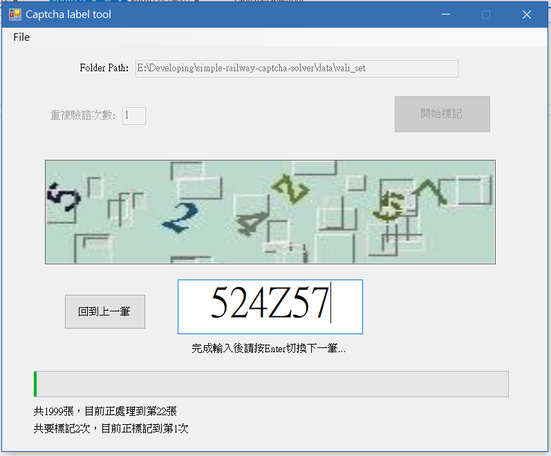
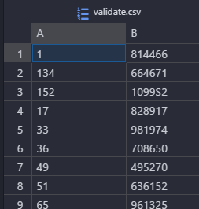

# captcha-label-tool



這是一個簡單的驗證碼手動標記工具，在需要大量手動標記驗證集時還蠻方便的。

使用時先選擇放圖片的目錄(只讀副檔名```.jpg```的圖，需要的話可自行修改code)，之後可以設定重複驗證的次數，就能開始標記。

舉個例子，如果設定一次：在輸入完全部答案第一次後，會再要求重複輸入相同的驗證碼第二次；若跟首次輸入不同會另外提示，要求檢查後輸入確認的答案，這樣可以盡可能避免標記到錯誤的答案。

## 輸出



輸出的csv中，分隔符號是```,```，每1個row是一筆驗證碼，其中第1個column是檔名，第2個column則是輸入的驗證碼。


## 環境

開發環境是```Visual Studio 2017```，使用```C#```。


## 改進方向

或許加個中途中斷儲存及還原的功能，不然資料一多，要一次打完還蠻麻煩的。
